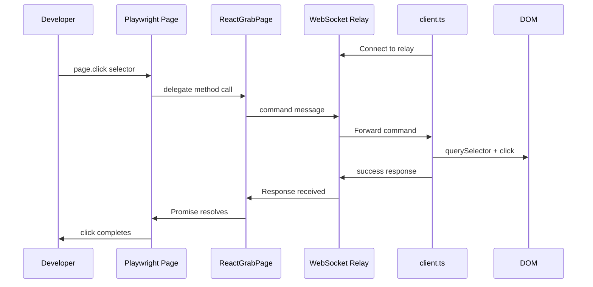

# React Grab Playwright Package

## Architecture

Instead of mocking Playwright's API, we implement a custom `PageDelegate` - the same interface that Chromium/Firefox/WebKit backends use. This gives us **full Playwright API compatibility for free**.



## Key Insight: PageDelegate Interface

Playwright's architecture uses a `PageDelegate` interface that all browser backends implement:

```typescript
// From playwright-core/src/server/page.ts
interface PageDelegate {
  readonly rawMouse: input.RawMouse;
  readonly rawKeyboard: input.RawKeyboard;
  readonly rawTouchscreen: input.RawTouchscreen;

  navigateFrame(frame: Frame, url: string, referrer?: string): Promise<GotoResult>;
  reload(): Promise<void>;
  goBack(): Promise<boolean>;
  goForward(): Promise<boolean>;
  // ... 20+ more methods
}
```

By implementing this interface, we get **all of Playwright's API** (locators, assertions, auto-waiting, etc.) working automatically.

## Package Structure

```
packages/provider-playwright/
  src/
    relay.ts           # WebSocket server + createRelay() + execute()
    client.ts          # Browser-side WS client + command handlers
    page-delegate.ts   # ReactGrabPage implements PageDelegate
    browser.ts         # ReactGrabBrowser + ReactGrabBrowserContext
    protocol.ts        # Shared command/response message types
    handlers.ts        # Browser-side DOM command implementations
    constants.ts       # Port, timeouts, etc.
  package.json
  tsconfig.json
  tsup.config.ts
```

## Key Components

### 1. `page-delegate.ts` - Complete PageDelegate Implementation

Implements Playwright's `PageDelegate` interface, routing all commands over WebSocket to handlers:

```typescript
import type { PageDelegate } from 'playwright-core/lib/server/page';
import type { Frame, GotoResult } from 'playwright-core/lib/server/frames';
import type { Page } from 'playwright-core/lib/server/page';
import type { BrowserContext } from 'playwright-core/lib/server/browserContext';
import type { WebSocketRelay } from './relay';

// ============================================
// RAW INPUT IMPLEMENTATIONS
// ============================================

class ReactGrabMouse {
  constructor(private relay: WebSocketRelay) {}

  async move(x: number, y: number): Promise<void> {
    await this.relay.send({ method: 'mouse.move', x, y });
  }

  async down(options?: { button?: number }): Promise<void> {
    await this.relay.send({ method: 'mouse.down', ...options });
  }

  async up(options?: { button?: number }): Promise<void> {
    await this.relay.send({ method: 'mouse.up', ...options });
  }

  async click(x: number, y: number, options?: { button?: number; clickCount?: number }): Promise<void> {
    await this.relay.send({ method: 'mouse.click', x, y, ...options });
  }

  async dblclick(x: number, y: number, options?: { button?: number }): Promise<void> {
    await this.relay.send({ method: 'mouse.click', x, y, clickCount: 2, ...options });
  }

  async wheel(deltaX: number, deltaY: number): Promise<void> {
    await this.relay.send({ method: 'mouse.wheel', deltaX, deltaY });
  }
}

class ReactGrabKeyboard {
  constructor(private relay: WebSocketRelay) {}

  async down(key: string): Promise<void> {
    await this.relay.send({ method: 'keyboard.down', key });
  }

  async up(key: string): Promise<void> {
    await this.relay.send({ method: 'keyboard.up', key });
  }

  async insertText(text: string): Promise<void> {
    await this.relay.send({ method: 'keyboard.insertText', text });
  }

  async type(text: string, options?: { delay?: number }): Promise<void> {
    await this.relay.send({ method: 'keyboard.type', text, ...options });
  }
}

class ReactGrabTouchscreen {
  constructor(private relay: WebSocketRelay) {}

  async tap(x: number, y: number): Promise<void> {
    await this.relay.send({ method: 'touch.tap', x, y });
  }
}

// ============================================
// PAGE DELEGATE IMPLEMENTATION
// ============================================

export class ReactGrabPage implements PageDelegate {
  private relay: WebSocketRelay;
  readonly _page: Page;
  readonly rawMouse: ReactGrabMouse;
  readonly rawKeyboard: ReactGrabKeyboard;
  readonly rawTouchscreen: ReactGrabTouchscreen;

  constructor(relay: WebSocketRelay, browserContext: BrowserContext) {
    this.relay = relay;
    this.rawMouse = new ReactGrabMouse(relay);
    this.rawKeyboard = new ReactGrabKeyboard(relay);
    this.rawTouchscreen = new ReactGrabTouchscreen(relay);
    this._page = new Page(this, browserContext);
  }

  // ============================================
  // NAVIGATION
  // ============================================

  async navigateFrame(frame: Frame, url: string, referrer?: string): Promise<GotoResult> {
    const result = await this.relay.send({ method: 'navigateFrame', url, frameId: frame._id, referrer });
    return { newDocumentId: result.newDocumentId };
  }

  async reload(): Promise<void> {
    await this.relay.send({ method: 'reload' });
  }

  async goBack(): Promise<boolean> {
    const result = await this.relay.send({ method: 'goBack' });
    return result.success;
  }

  async goForward(): Promise<boolean> {
    const result = await this.relay.send({ method: 'goForward' });
    return result.success;
  }

  // ============================================
  // VIEWPORT & CONTENT
  // ============================================

  async setViewportSize(viewportSize: { width: number; height: number }): Promise<void> {
    await this.relay.send({ method: 'setViewportSize', ...viewportSize });
  }

  async setExtraHTTPHeaders(headers: Record<string, string>): Promise<void> {
    // Store for future requests - handled at relay level
  }

  async setEmulateMedia(options: { media?: string; colorScheme?: string }): Promise<void> {
    // Can apply via CSS media queries in browser
  }

  async setContent(frame: Frame, html: string): Promise<void> {
    await this.relay.send({ method: 'setContent', html, frameId: frame._id });
  }

  // ============================================
  // ELEMENT OPERATIONS (called by Locator internally)
  // ============================================

  async querySelector(selector: string, frame: Frame): Promise<{ elementId?: string }> {
    const result = await this.relay.send({ method: 'querySelector', selector, frameId: frame._id });
    return { elementId: result.elementId };
  }

  async querySelectorAll(selector: string, frame: Frame): Promise<{ count: number }> {
    const result = await this.relay.send({ method: 'querySelectorAll', selector, frameId: frame._id });
    return { count: result.count };
  }

  async getContentQuads(selector: string): Promise<{ quads: Array<Array<{ x: number; y: number }>> }> {
    return await this.relay.send({ method: 'getContentQuads', selector });
  }

  async getBoundingBox(selector: string): Promise<{ x: number; y: number; width: number; height: number } | null> {
    return await this.relay.send({ method: 'getBoundingBox', selector });
  }

  // ============================================
  // ACTIONS (click, fill, etc.)
  // ============================================

  async click(selector: string, options?: { position?: { x: number; y: number }; button?: number; clickCount?: number }): Promise<void> {
    await this.relay.send({ method: 'click', selector, ...options });
  }

  async dblclick(selector: string, options?: { position?: { x: number; y: number } }): Promise<void> {
    await this.relay.send({ method: 'click', selector, clickCount: 2, ...options });
  }

  async fill(selector: string, value: string): Promise<void> {
    await this.relay.send({ method: 'fill', selector, value });
  }

  async selectText(selector: string): Promise<void> {
    await this.relay.send({ method: 'selectText', selector });
  }

  async check(selector: string, checked: boolean): Promise<void> {
    await this.relay.send({ method: 'check', selector, checked });
  }

  async selectOption(selector: string, values: string[]): Promise<string[]> {
    const result = await this.relay.send({ method: 'selectOption', selector, values });
    return result.selectedValues;
  }

  async setInputFiles(selector: string, files: Array<{ name: string; mimeType: string; buffer: ArrayBuffer }>): Promise<void> {
    await this.relay.send({ method: 'setInputFiles', selector, files });
  }

  async focus(selector: string): Promise<void> {
    await this.relay.send({ method: 'focus', selector });
  }

  async blur(selector: string): Promise<void> {
    await this.relay.send({ method: 'blur', selector });
  }

  async hover(selector: string): Promise<void> {
    await this.relay.send({ method: 'hover', selector });
  }

  async scrollIntoViewIfNeeded(selector: string): Promise<void> {
    await this.relay.send({ method: 'scrollIntoView', selector });
  }

  // ============================================
  // ELEMENT PROPERTIES
  // ============================================

  async textContent(selector: string): Promise<string | null> {
    const result = await this.relay.send({ method: 'textContent', selector });
    return result.result;
  }

  async innerText(selector: string): Promise<string> {
    const result = await this.relay.send({ method: 'innerText', selector });
    return result.result;
  }

  async innerHTML(selector: string): Promise<string> {
    const result = await this.relay.send({ method: 'innerHTML', selector });
    return result.result;
  }

  async getAttribute(selector: string, name: string): Promise<string | null> {
    const result = await this.relay.send({ method: 'getAttribute', selector, name });
    return result.result;
  }

  async getProperty(selector: string, name: string): Promise<unknown> {
    const result = await this.relay.send({ method: 'getProperty', selector, name });
    return result.result;
  }

  async isVisible(selector: string): Promise<boolean> {
    const result = await this.relay.send({ method: 'isVisible', selector });
    return result.result;
  }

  async isEnabled(selector: string): Promise<boolean> {
    const result = await this.relay.send({ method: 'isEnabled', selector });
    return result.result;
  }

  async isChecked(selector: string): Promise<boolean> {
    const result = await this.relay.send({ method: 'isChecked', selector });
    return result.result;
  }

  // ============================================
  // EVALUATION
  // ============================================

  async evaluate<T>(expression: string, args?: unknown[]): Promise<T> {
    const result = await this.relay.send({ method: 'evaluate', expression, args });
    return result.result as T;
  }

  async evaluateHandle(expression: string, args?: unknown[]): Promise<{ handleId: string }> {
    return await this.relay.send({ method: 'evaluateHandle', expression, args });
  }

  async addInitScript(script: string): Promise<void> {
    // Store script to inject on page load
    await this.relay.send({ method: 'addInitScript', script });
  }

  // ============================================
  // SCREENSHOTS
  // ============================================

  async screenshot(options?: {
    selector?: string;
    fullPage?: boolean;
    clip?: { x: number; y: number; width: number; height: number };
    type?: 'png' | 'jpeg';
    quality?: number;
    omitBackground?: boolean;
    animations?: 'disabled' | 'allow';
  }): Promise<Buffer> {
    const result = await this.relay.send({ method: 'screenshot', ...options });
    // Convert base64 data URL to Buffer
    const mimeMatch = (result.result as string).match(/^data:image\/(png|jpeg);base64,/);
    const base64 = (result.result as string).replace(/^data:image\/(png|jpeg);base64,/, '');
    return Buffer.from(base64, 'base64');
  }

  async pdf(options?: {
    scale?: number;
    displayHeaderFooter?: boolean;
    printBackground?: boolean;
    landscape?: boolean;
    format?: string;
  }): Promise<Buffer> {
    // Note: In browser context, this triggers print dialog
    await this.relay.send({ method: 'pdf', ...options });
    return Buffer.from([]); // PDF not directly capturable in browser
  }

  // ============================================
  // WAITING
  // ============================================

  async waitForSelector(selector: string, options?: { state?: string; timeout?: number }): Promise<void> {
    await this.relay.send({ method: 'waitForSelector', selector, ...options });
  }

  async waitForFunction(expression: string, args?: unknown[], options?: { timeout?: number }): Promise<unknown> {
    const result = await this.relay.send({ method: 'waitForFunction', expression, args, ...options });
    return result.result;
  }

  async waitForLoadState(state?: string, options?: { timeout?: number }): Promise<void> {
    await this.relay.send({ method: 'waitForLoadState', state, ...options });
  }

  // ============================================
  // DIALOGS
  // ============================================

  async handleDialog(action: 'accept' | 'dismiss', promptText?: string): Promise<void> {
    await this.relay.send({ method: 'handleDialog', action, promptText });
  }

  // ============================================
  // FRAMES
  // ============================================

  async getFrames(): Promise<Array<{ id: string; url: string; name: string }>> {
    const result = await this.relay.send({ method: 'getFrames' });
    return result.frames;
  }

  // ============================================
  // CONSOLE & ERRORS
  // ============================================

  async getConsoleMessages(): Promise<unknown[]> {
    const result = await this.relay.send({ method: 'getConsoleMessages' });
    return result.messages;
  }

  async getPageErrors(): Promise<unknown[]> {
    const result = await this.relay.send({ method: 'getPageErrors' });
    return result.errors;
  }
}
```

### 2. `browser.ts` - Browser & Context Classes

```typescript
import { Browser, BrowserContext } from 'playwright-core/lib/server/browser';

export class ReactGrabBrowser extends Browser {
  private relay: WebSocketRelay;

  constructor(relay: WebSocketRelay) {
    super();
    this.relay = relay;
  }

  async doCreateNewContext(options: BrowserContextOptions): Promise<BrowserContext> {
    return new ReactGrabBrowserContext(this, options, this.relay);
  }
}

export class ReactGrabBrowserContext extends BrowserContext {
  private relay: WebSocketRelay;

  override async doCreateNewPage(): Promise<Page> {
    const delegate = new ReactGrabPage(this.relay, this);
    return delegate._page; // Real Playwright Page using our delegate
  }
}
```

### 3. `relay.ts` - Complete WebSocket Server + API

```typescript
import { WebSocketServer, WebSocket } from 'ws';
import { createJiti } from 'jiti';
import { ReactGrabBrowser } from './browser';
import type { Command, Response, WebSocketRelay } from './protocol';
import { DEFAULT_PORT, COMMAND_TIMEOUT_MS } from './constants';

// ============================================
// WEBSOCKET RELAY IMPLEMENTATION
// ============================================

class WebSocketRelayImpl implements WebSocketRelay {
  private client: WebSocket | null = null;
  private pendingCommands = new Map<string, {
    resolve: (response: Response) => void;
    reject: (error: Error) => void;
    timeout: NodeJS.Timeout;
  }>();

  constructor(private wss: WebSocketServer) {
    wss.on('connection', (ws) => {
      this.client = ws;

      ws.on('message', (data) => {
        const response = JSON.parse(data.toString()) as Response;
        const pending = this.pendingCommands.get(response.id);
        if (pending) {
          clearTimeout(pending.timeout);
          this.pendingCommands.delete(response.id);
          if (response.success) {
            pending.resolve(response);
          } else {
            pending.reject(new Error(response.error || 'Command failed'));
          }
        }
      });

      ws.on('close', () => {
        this.client = null;
        // Reject all pending commands
        for (const [id, pending] of this.pendingCommands) {
          clearTimeout(pending.timeout);
          pending.reject(new Error('Client disconnected'));
        }
        this.pendingCommands.clear();
      });
    });
  }

  async send(command: Omit<Command, 'id'>): Promise<Response> {
    if (!this.client || this.client.readyState !== WebSocket.OPEN) {
      throw new Error('No client connected');
    }

    const id = crypto.randomUUID();
    const fullCommand: Command = { id, ...command } as Command;

    return new Promise((resolve, reject) => {
      const timeout = setTimeout(() => {
        this.pendingCommands.delete(id);
        reject(new Error(`Command timeout: ${command.method}`));
      }, COMMAND_TIMEOUT_MS);

      this.pendingCommands.set(id, { resolve, reject, timeout });
      this.client!.send(JSON.stringify(fullCommand));
    });
  }

  close(): void {
    for (const [, pending] of this.pendingCommands) {
      clearTimeout(pending.timeout);
      pending.reject(new Error('Relay closed'));
    }
    this.pendingCommands.clear();
    this.wss.close();
  }

  isConnected(): boolean {
    return this.client !== null && this.client.readyState === WebSocket.OPEN;
  }

  waitForConnection(): Promise<void> {
    if (this.isConnected()) return Promise.resolve();
    return new Promise((resolve) => {
      this.wss.once('connection', () => resolve());
    });
  }
}

// ============================================
// PUBLIC API
// ============================================

export interface RelayOptions {
  port?: number;
}

export interface Relay {
  /** Wait for a browser client to connect */
  waitForClient(): Promise<void>;

  /** Execute arbitrary Playwright code (TypeScript supported via jiti) */
  execute(code: string): Promise<unknown>;

  /** Get a raw Playwright page object for programmatic use */
  getPage(): Promise<import('playwright-core').Page>;

  /** Check if a client is connected */
  isConnected(): boolean;

  /** Close the relay server */
  close(): void;
}

export const createRelay = async (options: RelayOptions = {}): Promise<Relay> => {
  const port = options.port ?? DEFAULT_PORT;
  const wss = new WebSocketServer({ port });
  const relay = new WebSocketRelayImpl(wss);
  const jiti = createJiti(process.cwd());

  // Cache browser/context/page for reuse
  let browserInstance: ReactGrabBrowser | null = null;
  let pageInstance: import('playwright-core').Page | null = null;

  const getPage = async () => {
    if (!pageInstance) {
      browserInstance = new ReactGrabBrowser(relay);
      const context = await browserInstance.newContext();
      pageInstance = await context.newPage();
    }
    return pageInstance;
  };

  const execute = async (code: string): Promise<unknown> => {
    const page = await getPage();

    // Wrap code in async function and evaluate with jiti
    const wrappedCode = `
      export default async function(page) {
        ${code}
      }
    `;

    const mod = jiti.evalModule(wrappedCode);
    return mod.default(page);
  };

  console.log(`[react-grab/playwright] Relay server listening on ws://localhost:${port}`);

  return {
    waitForClient: () => relay.waitForConnection(),
    execute,
    getPage,
    isConnected: () => relay.isConnected(),
    close: () => {
      pageInstance = null;
      browserInstance = null;
      relay.close();
    },
  };
};

// ============================================
// CLI ENTRY POINT
// ============================================

if (import.meta.url === new URL(process.argv[1], 'file://').href) {
  const port = parseInt(process.env.PORT || String(DEFAULT_PORT), 10);
  createRelay({ port }).then((relay) => {
    console.log('Waiting for client connection...');
    relay.waitForClient().then(() => {
      console.log('Client connected!');
    });
  });
}
```

### 4. `client.ts` - Browser-side Handler

```typescript
import { handlers } from './handlers';

const DEFAULT_PORT = 3001;

export const connect = (port = DEFAULT_PORT) => {
  const ws = new WebSocket(`ws://localhost:${port}`);

  ws.onmessage = async (event) => {
    const command = JSON.parse(event.data);
    try {
      const result = await handlers[command.method](command);
      ws.send(JSON.stringify({ id: command.id, success: true, ...result }));
    } catch (error) {
      ws.send(JSON.stringify({
        id: command.id,
        success: false,
        error: error instanceof Error ? error.message : 'Unknown error'
      }));
    }
  };

  return ws;
};

// Auto-connect when imported
if (typeof window !== 'undefined') {
  connect();
}
```

### 5. `constants.ts`

```typescript
export const DEFAULT_PORT = 3001;
export const ELEMENT_WAIT_TIMEOUT_MS = 30000;
export const ELEMENT_POLL_INTERVAL_MS = 50;
export const WAIT_POLL_INTERVAL_MS = 100;
export const SCREENSHOT_TIMEOUT_MS = 5000;
export const VIDEO_READY_POLL_INTERVAL_MS = 50;
export const COMMAND_TIMEOUT_MS = 30000;
```

### 6. `handlers.ts` - DOM Command Implementations

```typescript
import type { Command } from './protocol';
import {
  ELEMENT_WAIT_TIMEOUT_MS,
  ELEMENT_POLL_INTERVAL_MS,
  WAIT_POLL_INTERVAL_MS,
  SCREENSHOT_TIMEOUT_MS,
  VIDEO_READY_POLL_INTERVAL_MS,
} from './constants';

const findElement = async (selector: string, timeout = ELEMENT_WAIT_TIMEOUT_MS): Promise<Element> => {
  const startTime = Date.now();
  while (Date.now() - startTime < timeout) {
    const element = document.querySelector(selector);
    if (element) return element;
    await new Promise(resolve => setTimeout(resolve, ELEMENT_POLL_INTERVAL_MS));
  }
  throw new Error(`Element not found: ${selector}`);
};

const dispatchMouseEvent = (element: Element, eventType: string, options: MouseEventInit = {}) => {
  const bounds = element.getBoundingClientRect();
  const event = new MouseEvent(eventType, {
    bubbles: true,
    cancelable: true,
    view: window,
    clientX: options.clientX ?? bounds.left + bounds.width / 2,
    clientY: options.clientY ?? bounds.top + bounds.height / 2,
    button: options.button ?? 0,
    buttons: options.buttons ?? 1,
    ...options,
  });
  element.dispatchEvent(event);
};

const dispatchKeyboardEvent = (element: Element, eventType: string, options: KeyboardEventInit) => {
  const event = new KeyboardEvent(eventType, {
    bubbles: true,
    cancelable: true,
    view: window,
    ...options,
  });
  element.dispatchEvent(event);
};

export const handlers: Record<string, (command: Command) => Promise<unknown>> = {
  navigateFrame: async ({ url, frameId }) => {
    if (frameId && frameId !== 'main') {
      const iframe = document.querySelector<HTMLIFrameElement>(`iframe[data-frame-id="${frameId}"]`);
      if (iframe?.contentWindow) {
        iframe.contentWindow.location.href = url;
      }
    } else {
      window.location.href = url;
    }
    return { newDocumentId: crypto.randomUUID() };
  },

  reload: async () => {
    window.location.reload();
    return {};
  },

  goBack: async () => {
    const canGoBack = window.history.length > 1;
    if (canGoBack) window.history.back();
    return { success: canGoBack };
  },

  goForward: async () => {
    window.history.forward();
    return { success: true };
  },

  setViewportSize: async ({ width, height }) => {
    let viewportMeta = document.querySelector('meta[name="viewport"]');
    if (!viewportMeta) {
      viewportMeta = document.createElement('meta');
      viewportMeta.setAttribute('name', 'viewport');
      document.head.appendChild(viewportMeta);
    }
    viewportMeta.setAttribute('content', `width=${width}, height=${height}`);
    return { width, height };
  },

  setContent: async ({ html, frameId }) => {
    if (frameId && frameId !== 'main') {
      const iframe = document.querySelector<HTMLIFrameElement>(`iframe[data-frame-id="${frameId}"]`);
      if (iframe?.contentDocument) {
        iframe.contentDocument.open();
        iframe.contentDocument.write(html);
        iframe.contentDocument.close();
      }
    } else {
      document.documentElement.innerHTML = html;
    }
    return {};
  },

  'mouse.move': async ({ x, y }) => {
    const element = document.elementFromPoint(x, y);
    if (element) dispatchMouseEvent(element, 'mousemove', { clientX: x, clientY: y });
    return {};
  },

  'mouse.down': async ({ x, y, button = 0 }) => {
    const element = document.elementFromPoint(x, y);
    if (element) dispatchMouseEvent(element, 'mousedown', { clientX: x, clientY: y, button });
    return {};
  },

  'mouse.up': async ({ x, y, button = 0 }) => {
    const element = document.elementFromPoint(x, y);
    if (element) dispatchMouseEvent(element, 'mouseup', { clientX: x, clientY: y, button });
    return {};
  },

  'mouse.click': async ({ x, y, button = 0, clickCount = 1 }) => {
    const element = document.elementFromPoint(x, y);
    if (element) {
      dispatchMouseEvent(element, 'mousedown', { clientX: x, clientY: y, button });
      dispatchMouseEvent(element, 'mouseup', { clientX: x, clientY: y, button });
      dispatchMouseEvent(element, 'click', { clientX: x, clientY: y, button });
      if (clickCount === 2) {
        dispatchMouseEvent(element, 'dblclick', { clientX: x, clientY: y, button });
      }
    }
    return {};
  },

  'mouse.wheel': async ({ x, y, deltaX = 0, deltaY = 0 }) => {
    const element = document.elementFromPoint(x, y);
    if (element) {
      element.dispatchEvent(new WheelEvent('wheel', {
        bubbles: true,
        cancelable: true,
        clientX: x,
        clientY: y,
        deltaX,
        deltaY,
        deltaMode: WheelEvent.DOM_DELTA_PIXEL,
      }));
    }
    return {};
  },

  'keyboard.down': async ({ key, code, modifiers = {} }) => {
    const activeElement = document.activeElement || document.body;
    dispatchKeyboardEvent(activeElement, 'keydown', {
      key,
      code: code || key,
      shiftKey: modifiers.shift,
      ctrlKey: modifiers.ctrl,
      altKey: modifiers.alt,
      metaKey: modifiers.meta,
    });
    return {};
  },

  'keyboard.up': async ({ key, code, modifiers = {} }) => {
    const activeElement = document.activeElement || document.body;
    dispatchKeyboardEvent(activeElement, 'keyup', {
      key,
      code: code || key,
      shiftKey: modifiers.shift,
      ctrlKey: modifiers.ctrl,
      altKey: modifiers.alt,
      metaKey: modifiers.meta,
    });
    return {};
  },

  'keyboard.insertText': async ({ text }) => {
    const inputElement = document.activeElement as HTMLInputElement | HTMLTextAreaElement;
    if (inputElement && 'value' in inputElement) {
      const selectionStart = inputElement.selectionStart ?? inputElement.value.length;
      const selectionEnd = inputElement.selectionEnd ?? inputElement.value.length;
      inputElement.value = inputElement.value.slice(0, selectionStart) + text + inputElement.value.slice(selectionEnd);
      inputElement.selectionStart = inputElement.selectionEnd = selectionStart + text.length;
      inputElement.dispatchEvent(new Event('input', { bubbles: true }));
    } else if (inputElement?.isContentEditable) {
      document.execCommand('insertText', false, text);
    }
    return {};
  },

  'keyboard.type': async ({ text, delay = 0 }) => {
    const inputElement = document.activeElement as HTMLInputElement | HTMLTextAreaElement;
    for (const character of text) {
      dispatchKeyboardEvent(inputElement, 'keydown', { key: character });
      dispatchKeyboardEvent(inputElement, 'keypress', { key: character });
      if ('value' in inputElement) {
        inputElement.value += character;
        inputElement.dispatchEvent(new Event('input', { bubbles: true }));
      }
      dispatchKeyboardEvent(inputElement, 'keyup', { key: character });
      if (delay > 0) await new Promise(resolve => setTimeout(resolve, delay));
    }
    return {};
  },

  'touch.tap': async ({ x, y }) => {
    const element = document.elementFromPoint(x, y);
    if (element) {
      const touch = new Touch({ identifier: Date.now(), target: element, clientX: x, clientY: y });
      element.dispatchEvent(new TouchEvent('touchstart', { bubbles: true, touches: [touch], targetTouches: [touch] }));
      element.dispatchEvent(new TouchEvent('touchend', { bubbles: true, touches: [], targetTouches: [] }));
    }
    return {};
  },

  querySelector: async ({ selector, frameId }) => {
    const rootDocument = frameId
      ? document.querySelector<HTMLIFrameElement>(`iframe[data-frame-id="${frameId}"]`)?.contentDocument
      : document;
    const element = rootDocument?.querySelector(selector);
    return { found: !!element, elementId: element ? crypto.randomUUID() : null };
  },

  querySelectorAll: async ({ selector, frameId }) => {
    const rootDocument = frameId
      ? document.querySelector<HTMLIFrameElement>(`iframe[data-frame-id="${frameId}"]`)?.contentDocument
      : document;
    const elements = rootDocument?.querySelectorAll(selector);
    return { count: elements?.length ?? 0 };
  },

  getContentQuads: async ({ selector }) => {
    const element = await findElement(selector);
    const bounds = element.getBoundingClientRect();
    return {
      quads: [[
        { x: bounds.left, y: bounds.top },
        { x: bounds.right, y: bounds.top },
        { x: bounds.right, y: bounds.bottom },
        { x: bounds.left, y: bounds.bottom },
      ]],
    };
  },

  getBoundingBox: async ({ selector }) => {
    const element = await findElement(selector);
    const bounds = element.getBoundingClientRect();
    return { x: bounds.x, y: bounds.y, width: bounds.width, height: bounds.height };
  },

  click: async ({ selector, position, button = 0, clickCount = 1 }) => {
    const element = await findElement(selector);
    const bounds = element.getBoundingClientRect();
    const clickX = position?.x ?? bounds.left + bounds.width / 2;
    const clickY = position?.y ?? bounds.top + bounds.height / 2;

    if ('focus' in element) (element as HTMLElement).focus();
    dispatchMouseEvent(element, 'mousedown', { clientX: clickX, clientY: clickY, button });
    dispatchMouseEvent(element, 'mouseup', { clientX: clickX, clientY: clickY, button });
    dispatchMouseEvent(element, 'click', { clientX: clickX, clientY: clickY, button });
    if (clickCount === 2) {
      dispatchMouseEvent(element, 'dblclick', { clientX: clickX, clientY: clickY, button });
    }
    return {};
  },

  fill: async ({ selector, value }) => {
    const inputElement = await findElement(selector) as HTMLInputElement | HTMLTextAreaElement;
    if ('focus' in inputElement) inputElement.focus();
    inputElement.value = '';
    inputElement.value = value;
    inputElement.dispatchEvent(new Event('input', { bubbles: true }));
    inputElement.dispatchEvent(new Event('change', { bubbles: true }));
    return {};
  },

  selectText: async ({ selector }) => {
    const inputElement = await findElement(selector) as HTMLInputElement | HTMLTextAreaElement;
    inputElement.select?.();
    return {};
  },

  check: async ({ selector, checked = true }) => {
    const checkboxElement = await findElement(selector) as HTMLInputElement;
    if (checkboxElement.checked !== checked) checkboxElement.click();
    return {};
  },

  selectOption: async ({ selector, values }) => {
    const selectElement = await findElement(selector) as HTMLSelectElement;
    for (const option of Array.from(selectElement.options)) {
      option.selected = values.includes(option.value) || values.includes(option.textContent || '');
    }
    selectElement.dispatchEvent(new Event('change', { bubbles: true }));
    return { selectedValues: Array.from(selectElement.selectedOptions).map(option => option.value) };
  },

  setInputFiles: async ({ selector, files }) => {
    const fileInputElement = await findElement(selector) as HTMLInputElement;
    const dataTransfer = new DataTransfer();
    for (const fileData of files) {
      const blob = new Blob([fileData.buffer], { type: fileData.mimeType });
      dataTransfer.items.add(new File([blob], fileData.name, { type: fileData.mimeType }));
    }
    fileInputElement.files = dataTransfer.files;
    fileInputElement.dispatchEvent(new Event('change', { bubbles: true }));
    return {};
  },

  focus: async ({ selector }) => {
    const element = await findElement(selector) as HTMLElement;
    element.focus();
    return {};
  },

  blur: async ({ selector }) => {
    const element = await findElement(selector) as HTMLElement;
    element.blur();
    return {};
  },

  hover: async ({ selector }) => {
    const element = await findElement(selector);
    const bounds = element.getBoundingClientRect();
    dispatchMouseEvent(element, 'mouseenter');
    dispatchMouseEvent(element, 'mouseover');
    dispatchMouseEvent(element, 'mousemove', { clientX: bounds.left + bounds.width / 2, clientY: bounds.top + bounds.height / 2 });
    return {};
  },

  scrollIntoView: async ({ selector }) => {
    const element = await findElement(selector);
    element.scrollIntoView({ behavior: 'instant', block: 'center', inline: 'center' });
    return {};
  },

  textContent: async ({ selector }) => {
    const element = await findElement(selector);
    return { result: element.textContent };
  },

  innerText: async ({ selector }) => {
    const element = await findElement(selector) as HTMLElement;
    return { result: element.innerText };
  },

  innerHTML: async ({ selector }) => {
    const element = await findElement(selector);
    return { result: element.innerHTML };
  },

  getAttribute: async ({ selector, name }) => {
    const element = await findElement(selector);
    return { result: element.getAttribute(name) };
  },

  getProperty: async ({ selector, name }) => {
    const element = await findElement(selector) as Record<string, unknown>;
    return { result: element[name] };
  },

  isVisible: async ({ selector }) => {
    const element = document.querySelector(selector) as HTMLElement;
    if (!element) return { result: false };
    const computedStyle = window.getComputedStyle(element);
    const bounds = element.getBoundingClientRect();
    const isVisible = computedStyle.display !== 'none' &&
      computedStyle.visibility !== 'hidden' &&
      parseFloat(computedStyle.opacity) > 0 &&
      bounds.width > 0 &&
      bounds.height > 0;
    return { result: isVisible };
  },

  isEnabled: async ({ selector }) => {
    const element = document.querySelector(selector) as HTMLInputElement;
    return { result: element ? !element.disabled : false };
  },

  isChecked: async ({ selector }) => {
    const element = document.querySelector(selector) as HTMLInputElement;
    return { result: element?.checked ?? false };
  },

  evaluate: async ({ expression, args = [] }) => {
    const evaluateFunction = new Function('...args', `return (async () => { return (${expression}); })(...args)`);
    const result = await evaluateFunction(...args);
    return { result };
  },

  evaluateHandle: async ({ expression, args = [] }) => {
    const evaluateFunction = new Function('...args', `return (${expression})(...args)`);
    const handle = await evaluateFunction(...args);
    const handleId = crypto.randomUUID();
    (window as Record<string, unknown>).__playwright_handles__ ??= {};
    (window as Record<string, Record<string, unknown>>).__playwright_handles__[handleId] = handle;
    return { handleId };
  },

  screenshot: async ({ selector, fullPage = false, clip, type = 'png', quality }) => {
    let captureBounds: { x: number; y: number; width: number; height: number };

    if (clip) {
      captureBounds = clip;
    } else if (selector) {
      const element = await findElement(selector);
      const elementBounds = element.getBoundingClientRect();
      captureBounds = { x: elementBounds.x, y: elementBounds.y, width: elementBounds.width, height: elementBounds.height };
    } else if (fullPage) {
      // HACK: fullPage with getDisplayMedia only captures visible viewport
      console.warn('fullPage screenshot captures visible viewport only in browser context');
      captureBounds = { x: 0, y: 0, width: window.innerWidth, height: window.innerHeight };
    } else {
      captureBounds = { x: 0, y: 0, width: window.innerWidth, height: window.innerHeight };
    }

    const displayStream = await navigator.mediaDevices.getDisplayMedia({
      video: { displaySurface: 'browser' },
      preferCurrentTab: true,
    } as DisplayMediaStreamOptions);

    const videoElement = document.createElement('video');
    videoElement.srcObject = displayStream;
    videoElement.autoplay = true;
    videoElement.playsInline = true;

    await new Promise<void>((resolve, reject) => {
      const timeoutId = setTimeout(() => reject(new Error('Screenshot timeout: video metadata not loaded')), SCREENSHOT_TIMEOUT_MS);
      videoElement.onloadedmetadata = () => { clearTimeout(timeoutId); void videoElement.play(); resolve(); };
      videoElement.onerror = () => { clearTimeout(timeoutId); reject(new Error('Screenshot failed: video error')); };
    });

    await new Promise<void>((resolve) => {
      const checkVideoReady = () => {
        if (videoElement.readyState >= HTMLMediaElement.HAVE_CURRENT_DATA) resolve();
        else setTimeout(checkVideoReady, VIDEO_READY_POLL_INTERVAL_MS);
      };
      checkVideoReady();
    });

    const canvas = document.createElement('canvas');
    const canvasContext = canvas.getContext('2d')!;

    const scaleX = videoElement.videoWidth / window.innerWidth;
    const scaleY = videoElement.videoHeight / window.innerHeight;
    const scaledBounds = {
      x: captureBounds.x * scaleX,
      y: captureBounds.y * scaleY,
      width: captureBounds.width * scaleX,
      height: captureBounds.height * scaleY,
    };

    canvas.width = scaledBounds.width;
    canvas.height = scaledBounds.height;
    canvasContext.drawImage(videoElement, scaledBounds.x, scaledBounds.y, scaledBounds.width, scaledBounds.height, 0, 0, scaledBounds.width, scaledBounds.height);

    displayStream.getTracks().forEach(track => track.stop());
    videoElement.srcObject = null;

    const mimeType = type === 'jpeg' ? 'image/jpeg' : 'image/png';
    return { result: canvas.toDataURL(mimeType, quality ? quality / 100 : 1) };
  },

  pdf: async () => {
    throw new Error('UNSUPPORTED: page.pdf() is not available in browser context');
  },

  'video.start': async () => {
    throw new Error('UNSUPPORTED: page.video() is not available in browser context');
  },

  'video.stop': async () => {
    throw new Error('UNSUPPORTED: page.video() is not available in browser context');
  },

  'tracing.start': async () => {
    throw new Error('UNSUPPORTED: tracing is not available in browser context');
  },

  'tracing.stop': async () => {
    throw new Error('UNSUPPORTED: tracing is not available in browser context');
  },

  waitForSelector: async ({ selector, state = 'visible', timeout = ELEMENT_WAIT_TIMEOUT_MS }) => {
    const startTime = Date.now();
    while (Date.now() - startTime < timeout) {
      const element = document.querySelector(selector) as HTMLElement;
      if (state === 'attached' && element) return {};
      if (state === 'detached' && !element) return {};
      if (state === 'visible' && element) {
        const computedStyle = window.getComputedStyle(element);
        if (computedStyle.display !== 'none' && computedStyle.visibility !== 'hidden') return {};
      }
      if (state === 'hidden' && (!element || window.getComputedStyle(element).display === 'none')) return {};
      await new Promise(resolve => setTimeout(resolve, WAIT_POLL_INTERVAL_MS));
    }
    throw new Error(`Timeout waiting for selector "${selector}" to be ${state}`);
  },

  waitForFunction: async ({ expression, args = [], timeout = ELEMENT_WAIT_TIMEOUT_MS }) => {
    const startTime = Date.now();
    const evaluateFunction = new Function('...args', `return (${expression})(...args)`);
    while (Date.now() - startTime < timeout) {
      const result = await evaluateFunction(...args);
      if (result) return { result };
      await new Promise(resolve => setTimeout(resolve, WAIT_POLL_INTERVAL_MS));
    }
    throw new Error('Timeout waiting for function');
  },

  waitForLoadState: async ({ state = 'load', timeout = ELEMENT_WAIT_TIMEOUT_MS }) => {
    if (state === 'domcontentloaded' && document.readyState !== 'loading') return {};
    if (state === 'load' && document.readyState === 'complete') return {};

    return new Promise((resolve, reject) => {
      const timeoutId = setTimeout(() => reject(new Error(`Timeout waiting for ${state}`)), timeout);
      const eventName = state === 'domcontentloaded' ? 'DOMContentLoaded' : 'load';
      window.addEventListener(eventName, () => {
        clearTimeout(timeoutId);
        resolve({});
      }, { once: true });
    });
  },

  waitForTimeout: async ({ timeout }) => {
    await new Promise(resolve => setTimeout(resolve, timeout));
    return {};
  },

  handleDialog: async ({ action, promptText }) => {
    (window as Record<string, unknown>).__playwright_dialog_handler__ = { action, promptText };
    return {};
  },

  getFrames: async () => {
    const iframeElements = document.querySelectorAll('iframe');
    return {
      frames: Array.from(iframeElements).map((iframe, index) => ({
        id: iframe.getAttribute('data-frame-id') || `frame-${index}`,
        url: iframe.src,
        name: iframe.name,
      })),
    };
  },

  getConsoleMessages: async () => {
    return { messages: (window as Record<string, unknown[]>).__playwright_console__ ?? [] };
  },

  getPageErrors: async () => {
    return { errors: (window as Record<string, unknown[]>).__playwright_errors__ ?? [] };
  },

  'route.add': async () => {
    throw new Error('UNSUPPORTED: page.route() requires Service Worker for true request interception');
  },

  'network.getRequests': async () => {
    const resourceEntries = performance.getEntriesByType('resource') as PerformanceResourceTiming[];
    return {
      requests: resourceEntries.map(entry => ({
        url: entry.name,
        type: entry.initiatorType,
        duration: entry.duration,
        size: entry.transferSize,
        startTime: entry.startTime,
      })),
    };
  },

  'network.clearCache': async () => {
    performance.clearResourceTimings();
    return {};
  },

  'cookies.get': async () => {
    const parsedCookies = document.cookie.split(';').map(cookieString => {
      const [name, ...valueParts] = cookieString.trim().split('=');
      return {
        name,
        value: valueParts.join('='),
        domain: window.location.hostname,
        path: '/',
        expires: -1,
        httpOnly: false,
        secure: window.location.protocol === 'https:',
        sameSite: 'Lax' as const,
      };
    }).filter(cookie => cookie.name);
    return { cookies: parsedCookies };
  },

  'cookies.add': async ({ cookies }) => {
    for (const cookie of cookies) {
      let cookieString = `${cookie.name}=${cookie.value}`;
      if (cookie.path) cookieString += `; path=${cookie.path}`;
      if (cookie.domain) cookieString += `; domain=${cookie.domain}`;
      if (cookie.expires) cookieString += `; expires=${new Date(cookie.expires * 1000).toUTCString()}`;
      if (cookie.secure) cookieString += '; secure';
      if (cookie.sameSite) cookieString += `; samesite=${cookie.sameSite}`;
      document.cookie = cookieString;
    }
    return {};
  },

  'cookies.clear': async () => {
    const cookieStrings = document.cookie.split(';');
    for (const cookieString of cookieStrings) {
      const [name] = cookieString.trim().split('=');
      document.cookie = `${name}=; expires=Thu, 01 Jan 1970 00:00:00 GMT; path=/`;
    }
    return {};
  },

  'storage.get': async ({ storageType = 'local' }) => {
    const storageInstance = storageType === 'session' ? sessionStorage : localStorage;
    const entries: Array<{ name: string; value: string }> = [];
    for (let index = 0; index < storageInstance.length; index++) {
      const name = storageInstance.key(index);
      if (name) entries.push({ name, value: storageInstance.getItem(name) || '' });
    }
    return { entries };
  },

  'storage.set': async ({ storageType = 'local', entries }) => {
    const storageInstance = storageType === 'session' ? sessionStorage : localStorage;
    for (const { name, value } of entries) {
      storageInstance.setItem(name, value);
    }
    return {};
  },

  'storage.clear': async ({ storageType = 'local' }) => {
    const storageInstance = storageType === 'session' ? sessionStorage : localStorage;
    storageInstance.clear();
    return {};
  },

  'permissions.grant': async ({ permissions }) => {
    // HACK: Can't actually grant permissions, just track them
    (window as Record<string, string[]>).__playwright_permissions__ = permissions;
    return {};
  },

  'permissions.query': async ({ name }) => {
    try {
      const permissionStatus = await navigator.permissions.query({ name: name as PermissionName });
      return { state: permissionStatus.state };
    } catch {
      return { state: 'denied' };
    }
  },

  'geolocation.set': async ({ latitude, longitude, accuracy = 0 }) => {
    const mockGeolocationPosition = {
      coords: { latitude, longitude, accuracy, altitude: null, altitudeAccuracy: null, heading: null, speed: null },
      timestamp: Date.now(),
    };

    navigator.geolocation.getCurrentPosition = (successCallback) => {
      successCallback(mockGeolocationPosition as GeolocationPosition);
    };

    navigator.geolocation.watchPosition = (successCallback) => {
      successCallback(mockGeolocationPosition as GeolocationPosition);
      return 1;
    };

    return {};
  },

  'emulation.setTimezone': async ({ timezoneId }) => {
    (window as Record<string, string>).__playwright_timezone__ = timezoneId;
    return {};
  },

  'emulation.setLocale': async ({ locale }) => {
    Object.defineProperty(navigator, 'language', { value: locale, writable: true });
    Object.defineProperty(navigator, 'languages', { value: [locale], writable: true });
    return {};
  },

  'emulation.setColorScheme': async ({ colorScheme }) => {
    const styleElement = document.getElementById('playwright-color-scheme') || document.createElement('style');
    styleElement.id = 'playwright-color-scheme';
    if (colorScheme === 'dark') {
      styleElement.textContent = ':root { color-scheme: dark; }';
      document.documentElement.style.colorScheme = 'dark';
    } else if (colorScheme === 'light') {
      styleElement.textContent = ':root { color-scheme: light; }';
      document.documentElement.style.colorScheme = 'light';
    }
    if (!styleElement.parentNode) document.head.appendChild(styleElement);
    return {};
  },

  'emulation.setReducedMotion': async ({ reducedMotion }) => {
    const styleElement = document.getElementById('playwright-reduced-motion') || document.createElement('style');
    styleElement.id = 'playwright-reduced-motion';
    styleElement.textContent = reducedMotion === 'reduce'
      ? '*, *::before, *::after { animation-duration: 0s !important; transition-duration: 0s !important; }'
      : '';
    if (!styleElement.parentNode) document.head.appendChild(styleElement);
    return {};
  },

  'emulation.setOffline': async ({ offline }) => {
    (window as Record<string, boolean>).__playwright_offline__ = offline;
    if (offline) {
      const originalFetchFunction = (window as Record<string, typeof fetch>).__original_fetch__ || window.fetch;
      (window as Record<string, typeof fetch>).__original_fetch__ = originalFetchFunction;
      window.fetch = async () => { throw new TypeError('Failed to fetch'); };
    } else if ((window as Record<string, typeof fetch>).__original_fetch__) {
      window.fetch = (window as Record<string, typeof fetch>).__original_fetch__;
    }
    return {};
  },

  'emulation.setUserAgent': async ({ userAgent }) => {
    Object.defineProperty(navigator, 'userAgent', { value: userAgent, writable: true });
    return {};
  },

  dragAndDrop: async ({ sourceSelector, targetSelector, sourcePosition, targetPosition }) => {
    const sourceElement = await findElement(sourceSelector);
    const targetElement = await findElement(targetSelector);

    const sourceBounds = sourceElement.getBoundingClientRect();
    const targetBounds = targetElement.getBoundingClientRect();

    const sourceX = sourcePosition?.x ?? sourceBounds.left + sourceBounds.width / 2;
    const sourceY = sourcePosition?.y ?? sourceBounds.top + sourceBounds.height / 2;
    const targetX = targetPosition?.x ?? targetBounds.left + targetBounds.width / 2;
    const targetY = targetPosition?.y ?? targetBounds.top + targetBounds.height / 2;

    const dataTransfer = new DataTransfer();

    sourceElement.dispatchEvent(new DragEvent('dragstart', { bubbles: true, cancelable: true, dataTransfer, clientX: sourceX, clientY: sourceY }));
    sourceElement.dispatchEvent(new DragEvent('drag', { bubbles: true, cancelable: true, dataTransfer, clientX: sourceX, clientY: sourceY }));
    targetElement.dispatchEvent(new DragEvent('dragenter', { bubbles: true, cancelable: true, dataTransfer, clientX: targetX, clientY: targetY }));
    targetElement.dispatchEvent(new DragEvent('dragover', { bubbles: true, cancelable: true, dataTransfer, clientX: targetX, clientY: targetY }));
    targetElement.dispatchEvent(new DragEvent('drop', { bubbles: true, cancelable: true, dataTransfer, clientX: targetX, clientY: targetY }));
    sourceElement.dispatchEvent(new DragEvent('dragend', { bubbles: true, cancelable: true, dataTransfer, clientX: targetX, clientY: targetY }));

    return {};
  },

  'clipboard.read': async () => {
    try {
      const clipboardText = await navigator.clipboard.readText();
      return { text: clipboardText };
    } catch {
      return { text: null, error: 'Clipboard access denied' };
    }
  },

  'clipboard.write': async ({ text }) => {
    try {
      await navigator.clipboard.writeText(text);
      return { success: true };
    } catch {
      return { success: false, error: 'Clipboard access denied' };
    }
  },

  'accessibility.snapshot': async ({ root, interestingOnly = true }) => {
    const IMPLICIT_ROLE_MAP: Record<string, string> = {
      a: 'link', button: 'button', input: 'textbox', select: 'combobox',
      textarea: 'textbox', img: 'img', nav: 'navigation', main: 'main',
      header: 'banner', footer: 'contentinfo', form: 'form', table: 'table',
      ul: 'list', ol: 'list', li: 'listitem', h1: 'heading', h2: 'heading',
      h3: 'heading', h4: 'heading', h5: 'heading', h6: 'heading',
    };

    const buildAccessibilityTree = (element: Element): object | null => {
      const role = element.getAttribute('role') || IMPLICIT_ROLE_MAP[element.tagName.toLowerCase()] || null;
      const name = element.getAttribute('aria-label') || (element as HTMLElement).innerText?.slice(0, 100);

      if (interestingOnly && !role && !name) return null;

      const node: Record<string, unknown> = { role: role || 'generic', name: name || '' };

      if (element.getAttribute('aria-disabled') === 'true' || (element as HTMLInputElement).disabled) {
        node.disabled = true;
      }
      if (element.getAttribute('aria-checked')) {
        node.checked = element.getAttribute('aria-checked') === 'true';
      }
      if ((element as HTMLInputElement).value !== undefined) {
        node.value = (element as HTMLInputElement).value;
      }

      const childNodes: object[] = [];
      for (const childElement of element.children) {
        const childNode = buildAccessibilityTree(childElement);
        if (childNode) childNodes.push(childNode);
      }
      if (childNodes.length > 0) node.children = childNodes;

      return node;
    };

    const rootElement = root ? await findElement(root) : document.body;
    return { tree: buildAccessibilityTree(rootElement) };
  },

  'page.bringToFront': async () => {
    window.focus();
    return {};
  },

  'page.close': async () => {
    window.close();
    return {};
  },

  'page.title': async () => ({ title: document.title }),

  'page.url': async () => ({ url: window.location.href }),

  exposeFunction: async ({ name }) => {
    (window as Record<string, (...args: unknown[]) => Promise<unknown>>)[name] = async (...args: unknown[]) => {
      return new Promise((resolve) => {
        const callId = crypto.randomUUID();
        (window as Record<string, Map<string, (result: unknown) => void>>).__playwright_exposed_calls__ ??= new Map();
        (window as Record<string, Map<string, (result: unknown) => void>>).__playwright_exposed_calls__.set(callId, resolve);
        window.dispatchEvent(new CustomEvent('playwright:exposed-call', { detail: { name, args, callId } }));
      });
    };
    return {};
  },

  'exposeFunction.resolve': async ({ callId, result }) => {
    const exposedCalls = (window as Record<string, Map<string, (result: unknown) => void>>).__playwright_exposed_calls__;
    const resolveFunction = exposedCalls?.get(callId);
    if (resolveFunction) {
      resolveFunction(result);
      exposedCalls.delete(callId);
    }
    return {};
  },

  addInitScript: async ({ script }) => {
    const initScripts = ((window as Record<string, string[]>).__playwright_init_scripts__ ??= []);
    initScripts.push(script);
    const executeScript = new Function(script);
    executeScript();
    return {};
  },

  'expect.toBeVisible': async ({ selector, timeout = ELEMENT_WAIT_TIMEOUT_MS }) => {
    const startTime = Date.now();
    while (Date.now() - startTime < timeout) {
      const element = document.querySelector(selector) as HTMLElement;
      if (element) {
        const computedStyle = window.getComputedStyle(element);
        const bounds = element.getBoundingClientRect();
        if (computedStyle.display !== 'none' && computedStyle.visibility !== 'hidden' && bounds.width > 0 && bounds.height > 0) {
          return { pass: true };
        }
      }
      await new Promise(resolve => setTimeout(resolve, WAIT_POLL_INTERVAL_MS));
    }
    return { pass: false, message: `Element ${selector} is not visible` };
  },

  'expect.toBeHidden': async ({ selector, timeout = ELEMENT_WAIT_TIMEOUT_MS }) => {
    const startTime = Date.now();
    while (Date.now() - startTime < timeout) {
      const element = document.querySelector(selector) as HTMLElement;
      if (!element) return { pass: true };
      const computedStyle = window.getComputedStyle(element);
      if (computedStyle.display === 'none' || computedStyle.visibility === 'hidden') {
        return { pass: true };
      }
      await new Promise(resolve => setTimeout(resolve, WAIT_POLL_INTERVAL_MS));
    }
    return { pass: false, message: `Element ${selector} is still visible` };
  },

  'expect.toHaveText': async ({ selector, expected, timeout = ELEMENT_WAIT_TIMEOUT_MS, useInnerText = false }) => {
    const startTime = Date.now();
    while (Date.now() - startTime < timeout) {
      const element = document.querySelector(selector) as HTMLElement;
      const actualText = useInnerText ? element?.innerText : element?.textContent;
      if (actualText?.includes(expected)) {
        return { pass: true, actual: actualText };
      }
      await new Promise(resolve => setTimeout(resolve, WAIT_POLL_INTERVAL_MS));
    }
    const element = document.querySelector(selector) as HTMLElement;
    return { pass: false, actual: useInnerText ? element?.innerText : element?.textContent, expected };
  },

  'expect.toHaveValue': async ({ selector, expected, timeout = ELEMENT_WAIT_TIMEOUT_MS }) => {
    const startTime = Date.now();
    while (Date.now() - startTime < timeout) {
      const inputElement = document.querySelector(selector) as HTMLInputElement;
      if (inputElement?.value === expected) {
        return { pass: true, actual: inputElement.value };
      }
      await new Promise(resolve => setTimeout(resolve, WAIT_POLL_INTERVAL_MS));
    }
    const inputElement = document.querySelector(selector) as HTMLInputElement;
    return { pass: false, actual: inputElement?.value, expected };
  },

  'expect.toHaveAttribute': async ({ selector, name, expected, timeout = ELEMENT_WAIT_TIMEOUT_MS }) => {
    const startTime = Date.now();
    while (Date.now() - startTime < timeout) {
      const element = document.querySelector(selector);
      const actualValue = element?.getAttribute(name);
      if (expected === undefined ? actualValue !== null : actualValue === expected) {
        return { pass: true, actual: actualValue };
      }
      await new Promise(resolve => setTimeout(resolve, WAIT_POLL_INTERVAL_MS));
    }
    const element = document.querySelector(selector);
    return { pass: false, actual: element?.getAttribute(name), expected };
  },

  'expect.toHaveClass': async ({ selector, expected, timeout = ELEMENT_WAIT_TIMEOUT_MS }) => {
    const startTime = Date.now();
    const expectedClassNames = Array.isArray(expected) ? expected : [expected];
    while (Date.now() - startTime < timeout) {
      const element = document.querySelector(selector);
      if (element && expectedClassNames.every(className => element.classList.contains(className))) {
        return { pass: true, actual: Array.from(element.classList) };
      }
      await new Promise(resolve => setTimeout(resolve, WAIT_POLL_INTERVAL_MS));
    }
    const element = document.querySelector(selector);
    return { pass: false, actual: element ? Array.from(element.classList) : [], expected: expectedClassNames };
  },

  'expect.toBeEnabled': async ({ selector, timeout = ELEMENT_WAIT_TIMEOUT_MS }) => {
    const startTime = Date.now();
    while (Date.now() - startTime < timeout) {
      const inputElement = document.querySelector(selector) as HTMLInputElement;
      if (inputElement && !inputElement.disabled) {
        return { pass: true };
      }
      await new Promise(resolve => setTimeout(resolve, WAIT_POLL_INTERVAL_MS));
    }
    return { pass: false, message: `Element ${selector} is disabled` };
  },

  'expect.toBeChecked': async ({ selector, timeout = ELEMENT_WAIT_TIMEOUT_MS }) => {
    const startTime = Date.now();
    while (Date.now() - startTime < timeout) {
      const checkboxElement = document.querySelector(selector) as HTMLInputElement;
      if (checkboxElement?.checked) {
        return { pass: true };
      }
      await new Promise(resolve => setTimeout(resolve, WAIT_POLL_INTERVAL_MS));
    }
    return { pass: false, message: `Element ${selector} is not checked` };
  },

  'expect.toHaveCount': async ({ selector, expected, timeout = ELEMENT_WAIT_TIMEOUT_MS }) => {
    const startTime = Date.now();
    while (Date.now() - startTime < timeout) {
      const elementCount = document.querySelectorAll(selector).length;
      if (elementCount === expected) {
        return { pass: true, actual: elementCount };
      }
      await new Promise(resolve => setTimeout(resolve, WAIT_POLL_INTERVAL_MS));
    }
    return { pass: false, actual: document.querySelectorAll(selector).length, expected };
  },
};

// Install console/error interceptors
if (typeof window !== 'undefined') {
  (window as Record<string, unknown[]>).__playwright_console__ = [];
  (window as Record<string, unknown[]>).__playwright_errors__ = [];

  const originalConsole = { ...console };
  ['log', 'warn', 'error', 'info', 'debug'].forEach(method => {
    (console as Record<string, (...args: unknown[]) => void>)[method] = (...args: unknown[]) => {
      (window as Record<string, unknown[]>).__playwright_console__.push({ type: method, args, timestamp: Date.now() });
      (originalConsole as Record<string, (...args: unknown[]) => void>)[method](...args);
    };
  });

  window.addEventListener('error', (event) => {
    (window as Record<string, unknown[]>).__playwright_errors__.push({
      message: event.message,
      filename: event.filename,
      lineno: event.lineno,
      colno: event.colno,
      timestamp: Date.now(),
    });
  });

  // Dialog handling
  const originalAlert = window.alert;
  const originalConfirm = window.confirm;
  const originalPrompt = window.prompt;

  window.alert = (message) => {
    const handler = (window as Record<string, { action: string }>).__playwright_dialog_handler__;
    if (handler?.action === 'dismiss') return;
    originalAlert(message);
  };

  window.confirm = (message) => {
    const handler = (window as Record<string, { action: string }>).__playwright_dialog_handler__;
    if (handler) {
      delete (window as Record<string, unknown>).__playwright_dialog_handler__;
      return handler.action === 'accept';
    }
    return originalConfirm(message);
  };

  window.prompt = (message, defaultValue) => {
    const handler = (window as Record<string, { action: string; promptText?: string }>).__playwright_dialog_handler__;
    if (handler) {
      delete (window as Record<string, unknown>).__playwright_dialog_handler__;
      return handler.action === 'accept' ? (handler.promptText ?? defaultValue ?? '') : null;
    }
    return originalPrompt(message, defaultValue);
  };
}
```

### 7. `protocol.ts` - Command/Response Types

```typescript
// ============================================
// COMMAND TYPES
// ============================================

export type CommandMethod =
  // Navigation
  | 'navigateFrame'
  | 'reload'
  | 'goBack'
  | 'goForward'
  // Viewport & Content
  | 'setViewportSize'
  | 'setContent'
  // Mouse
  | 'mouse.move'
  | 'mouse.down'
  | 'mouse.up'
  | 'mouse.click'
  | 'mouse.wheel'
  // Keyboard
  | 'keyboard.down'
  | 'keyboard.up'
  | 'keyboard.insertText'
  | 'keyboard.type'
  // Touch
  | 'touch.tap'
  // Element queries
  | 'querySelector'
  | 'querySelectorAll'
  | 'getContentQuads'
  | 'getBoundingBox'
  // Actions
  | 'click'
  | 'fill'
  | 'selectText'
  | 'check'
  | 'selectOption'
  | 'setInputFiles'
  | 'focus'
  | 'dragAndDrop'
  | 'blur'
  | 'hover'
  | 'scrollIntoView'
  // Properties
  | 'textContent'
  | 'innerText'
  | 'innerHTML'
  | 'getAttribute'
  | 'getProperty'
  | 'isVisible'
  | 'isEnabled'
  | 'isChecked'
  // Evaluation
  | 'evaluate'
  | 'evaluateHandle'
  | 'addInitScript'
  // Screenshots & PDF
  | 'screenshot'
  | 'pdf'
  // Waiting
  | 'waitForSelector'
  | 'waitForFunction'
  | 'waitForLoadState'
  | 'waitForTimeout'
  // Dialogs
  | 'handleDialog'
  // Frames
  | 'getFrames'
  // Console
  | 'getConsoleMessages'
  | 'getPageErrors';

export interface Command {
  id: string;
  method: CommandMethod;

  // Navigation
  url?: string;
  frameId?: string;
  referrer?: string;
  html?: string;

  // Viewport
  width?: number;
  height?: number;

  // Mouse/Touch coordinates
  x?: number;
  y?: number;
  deltaX?: number;
  deltaY?: number;
  button?: number;
  clickCount?: number;

  // Keyboard
  key?: string;
  code?: string;
  text?: string;
  delay?: number;
  modifiers?: {
    shift?: boolean;
    ctrl?: boolean;
    alt?: boolean;
    meta?: boolean;
  };

  // Element
  selector?: string;
  position?: { x: number; y: number };

  // Fill/Select
  value?: string;
  values?: string[];
  checked?: boolean;

  // Files
  files?: Array<{
    name: string;
    mimeType: string;
    buffer: ArrayBuffer;
  }>;

  // Attributes/Properties
  name?: string;

  // Evaluate
  expression?: string;
  script?: string;
  args?: unknown[];

  // Screenshot
  fullPage?: boolean;
  clip?: { x: number; y: number; width: number; height: number };
  type?: 'png' | 'jpeg';
  quality?: number; // 0-100 for jpeg
  omitBackground?: boolean;
  animations?: 'disabled' | 'allow';

  // PDF
  scale?: number;
  displayHeaderFooter?: boolean;
  printBackground?: boolean;
  landscape?: boolean;
  format?: string;

  // Waiting
  state?: 'attached' | 'detached' | 'visible' | 'hidden';
  timeout?: number;

  // Dialog
  action?: 'accept' | 'dismiss';
  promptText?: string;
}

// ============================================
// RESPONSE TYPES
// ============================================

export interface Response {
  id: string;
  success: boolean;
  error?: string;

  // Navigation
  newDocumentId?: string;

  // Element queries
  found?: boolean;
  elementId?: string;
  count?: number;
  quads?: Array<Array<{ x: number; y: number }>>;

  // Bounding box
  x?: number;
  y?: number;
  width?: number;
  height?: number;

  // Properties
  result?: unknown;

  // Select
  selectedValues?: string[];

  // Evaluate
  handleId?: string;

  // Frames
  frames?: Array<{ id: string; url: string; name: string }>;

  // Console
  messages?: unknown[];
  errors?: unknown[];
}

// ============================================
// RELAY INTERFACE
// ============================================

export interface WebSocketRelay {
  send(command: Omit<Command, 'id'>): Promise<Response>;
  close(): void;
}
```

## Complete Method Mapping

| Playwright API | PageDelegate Method | Handler | Browser Implementation |

|----------------|---------------------|---------|------------------------|

| `page.goto(url)` | `navigateFrame()` | `navigateFrame` | `window.location.href = url` |

| `page.reload()` | `reload()` | `reload` | `window.location.reload()` |

| `page.goBack()` | `goBack()` | `goBack` | `window.history.back()` |

| `page.goForward()` | `goForward()` | `goForward` | `window.history.forward()` |

| `page.setContent(html)` | `setContent()` | `setContent` | `document.documentElement.innerHTML = html` |

| `page.click(sel)` | `click()` | `click` | `el.click()` + mouse events |

| `page.fill(sel, val)` | `fill()` | `fill` | `el.value = val` + input/change events |

| `page.check(sel)` | `check()` | `check` | `el.click()` if not checked |

| `page.selectOption(sel, val)` | `selectOption()` | `selectOption` | Set `option.selected` + change event |

| `page.hover(sel)` | `hover()` | `hover` | mouseenter/mouseover/mousemove events |

| `page.focus(sel)` | `focus()` | `focus` | `el.focus()` |

| `locator.textContent()` | `textContent()` | `textContent` | `el.textContent` |

| `locator.innerText()` | `innerText()` | `innerText` | `el.innerText` |

| `locator.innerHTML()` | `innerHTML()` | `innerHTML` | `el.innerHTML` |

| `locator.getAttribute(n)` | `getAttribute()` | `getAttribute` | `el.getAttribute(n)` |

| `locator.isVisible()` | `isVisible()` | `isVisible` | Check display/visibility/opacity/bounds |

| `locator.isEnabled()` | `isEnabled()` | `isEnabled` | `!el.disabled` |

| `page.evaluate(fn)` | `evaluate()` | `evaluate` | `new Function(...)()` |

| `page.screenshot()` | `screenshot()` | `screenshot` | getDisplayMedia (requires permission) |

| `page.screenshot({clip})` | `screenshot()` | `screenshot` | Clip region from capture |

| `locator.screenshot()` | `screenshot()` | `screenshot` | Element bounds capture |

| `page.pdf()` | - | - | **UNSUPPORTED** (throws error) |

| `page.route()` | - | - | **UNSUPPORTED** (throws error) |

| `page.video()` | - | - | **UNSUPPORTED** (throws error) |

| `page.waitForSelector(sel)` | `waitForSelector()` | `waitForSelector` | Poll `querySelector` |

| `page.mouse.click(x,y)` | `rawMouse.click()` | `mouse.click` | Dispatch MouseEvent |

| `page.keyboard.type(text)` | `rawKeyboard.type()` | `keyboard.type` | Dispatch KeyboardEvent |

## API Support Matrix

### SUPPORTED (Full)

| Category | APIs |

|----------|------|

| **Navigation** | `goto()`, `reload()`, `goBack()`, `goForward()` |

| **Locators** | `locator()`, `getByRole()`, `getByText()`, `getByLabel()`, `getByPlaceholder()`, `getByTestId()` |

| **Actions** | `click()`, `dblclick()`, `fill()`, `type()`, `press()`, `check()`, `uncheck()`, `selectOption()`, `hover()`, `focus()`, `blur()` |

| **Queries** | `textContent()`, `innerText()`, `innerHTML()`, `getAttribute()`, `inputValue()` |

| **State** | `isVisible()`, `isHidden()`, `isEnabled()`, `isDisabled()`, `isChecked()` |

| **Mouse** | `mouse.click()`, `mouse.dblclick()`, `mouse.move()`, `mouse.down()`, `mouse.up()`, `mouse.wheel()` |

| **Keyboard** | `keyboard.type()`, `keyboard.press()`, `keyboard.down()`, `keyboard.up()`, `keyboard.insertText()` |

| **Touch** | `touchscreen.tap()` |

| **Waiting** | `waitForSelector()`, `waitForFunction()`, `waitForLoadState()`, `waitForTimeout()` |

| **Evaluate** | `evaluate()`, `evaluateHandle()`, `addInitScript()`, `exposeFunction()` |

| **Cookies** | `context.cookies()`, `context.addCookies()`, `context.clearCookies()` |

| **Storage** | `localStorage`, `sessionStorage` operations |

| **Emulation** | `setViewportSize()`, color scheme, locale, timezone, user agent, offline mode |

| **Clipboard** | `clipboard.read()`, `clipboard.write()` (requires permission) |

| **Dialogs** | `page.on('dialog')`, `dialog.accept()`, `dialog.dismiss()` |

| **Drag & Drop** | `dragAndDrop()` |

| **Accessibility** | `accessibility.snapshot()` |

| **Page Info** | `title()`, `url()`, `content()` |

### SUPPORTED (Partial)

| API | Limitation |

|-----|------------|

| `screenshot()` | Requires user permission via `getDisplayMedia`. Only captures visible viewport. |

| `setInputFiles()` | Works but user must grant file access |

| `geolocation` | Can mock, but actual GPS not available |

| `permissions` | Can query but can't actually grant |

### NOT SUPPORTED (Will Throw Error)

| API | Reason |

|-----|--------|

| `page.pdf()` | Requires CDP/browser internals |

| `page.video()` | Can't record to file from browser |

| `tracing.start/stop()` | Requires browser internals |

| `context.newPage()` | Can't open tabs programmatically |

| `page.route()` (full) | Service Worker required for true interception |

| `browserContext.storageState()` | Can't serialize full state |

| `page.coverage` | Requires CDP |

| `browser.newContext()` | Single context only |

## Usage Example

```typescript
// Server side (test file or script)
import { createRelay } from '@react-grab/playwright';

const relay = await createRelay({ port: 3001 });
await relay.waitForClient(); // Wait for browser to connect

// Code is evaluated with jiti - supports TypeScript natively
await relay.execute(`
  await page.click('.login-button');
  await page.fill('#username', 'testuser');
  await page.fill('#password', 'secret');
  await page.click('button[type="submit"]');

  const text: string = await page.locator('.welcome').textContent();
  console.log(text);
`);

relay.close();
```
```typescript
// Browser side (auto-attached via React Grab plugin)
import '@react-grab/playwright/client';
// Automatically connects to ws://localhost:3001
```

## Tests

### 8. `test/handlers.test.ts` - Unit Tests for Handlers

```typescript
import { describe, it, expect, beforeEach, vi } from 'vitest';
import { handlers } from '../src/handlers';

describe('handlers', () => {
  beforeEach(() => {
    document.body.innerHTML = '';
  });

  describe('navigation', () => {
    it('navigateFrame should set window.location.href', async () => {
      const originalLocation = window.location.href;
      const result = await handlers.navigateFrame({ url: 'https://example.com', frameId: undefined });
      expect(result.newDocumentId).toBeDefined();
    });

    it('goBack should return success based on history length', async () => {
      const result = await handlers.goBack({});
      expect(typeof result.success).toBe('boolean');
    });

    it('goForward should return success true', async () => {
      const result = await handlers.goForward({});
      expect(result.success).toBe(true);
    });
  });

  describe('element queries', () => {
    it('querySelector should find existing element', async () => {
      document.body.innerHTML = '<button id="test-btn">Click me</button>';
      const result = await handlers.querySelector({ selector: '#test-btn', frameId: undefined });
      expect(result.found).toBe(true);
      expect(result.elementId).toBeDefined();
    });

    it('querySelector should return found=false for missing element', async () => {
      const result = await handlers.querySelector({ selector: '#nonexistent', frameId: undefined });
      expect(result.found).toBe(false);
      expect(result.elementId).toBeNull();
    });

    it('querySelectorAll should return correct count', async () => {
      document.body.innerHTML = '<div class="item"></div><div class="item"></div><div class="item"></div>';
      const result = await handlers.querySelectorAll({ selector: '.item', frameId: undefined });
      expect(result.count).toBe(3);
    });

    it('getBoundingBox should return element bounds', async () => {
      document.body.innerHTML = '<div id="box" style="width: 100px; height: 50px;"></div>';
      const result = await handlers.getBoundingBox({ selector: '#box' });
      expect(result.width).toBeGreaterThan(0);
      expect(result.height).toBeGreaterThan(0);
    });
  });

  describe('element actions', () => {
    it('click should dispatch click event', async () => {
      const clickHandler = vi.fn();
      document.body.innerHTML = '<button id="btn">Click</button>';
      document.getElementById('btn')?.addEventListener('click', clickHandler);

      await handlers.click({ selector: '#btn', button: 0, clickCount: 1 });
      expect(clickHandler).toHaveBeenCalled();
    });

    it('fill should set input value and dispatch events', async () => {
      const inputHandler = vi.fn();
      document.body.innerHTML = '<input id="input" type="text" />';
      const inputElement = document.getElementById('input') as HTMLInputElement;
      inputElement.addEventListener('input', inputHandler);

      await handlers.fill({ selector: '#input', value: 'test value' });
      expect(inputElement.value).toBe('test value');
      expect(inputHandler).toHaveBeenCalled();
    });

    it('check should toggle checkbox state', async () => {
      document.body.innerHTML = '<input id="checkbox" type="checkbox" />';
      const checkboxElement = document.getElementById('checkbox') as HTMLInputElement;

      await handlers.check({ selector: '#checkbox', checked: true });
      expect(checkboxElement.checked).toBe(true);

      await handlers.check({ selector: '#checkbox', checked: false });
      expect(checkboxElement.checked).toBe(false);
    });

    it('selectOption should select options in select element', async () => {
      document.body.innerHTML = `
        <select id="select">
          <option value="a">Option A</option>
          <option value="b">Option B</option>
          <option value="c">Option C</option>
        </select>
      `;
      const result = await handlers.selectOption({ selector: '#select', values: ['b'] });
      expect(result.selectedValues).toContain('b');
    });

    it('focus should focus element', async () => {
      document.body.innerHTML = '<input id="input" type="text" />';
      await handlers.focus({ selector: '#input' });
      expect(document.activeElement?.id).toBe('input');
    });

    it('blur should blur element', async () => {
      document.body.innerHTML = '<input id="input" type="text" />';
      const inputElement = document.getElementById('input') as HTMLInputElement;
      inputElement.focus();

      await handlers.blur({ selector: '#input' });
      expect(document.activeElement).not.toBe(inputElement);
    });
  });

  describe('element properties', () => {
    it('textContent should return element text', async () => {
      document.body.innerHTML = '<p id="text">Hello World</p>';
      const result = await handlers.textContent({ selector: '#text' });
      expect(result.result).toBe('Hello World');
    });

    it('innerHTML should return element HTML', async () => {
      document.body.innerHTML = '<div id="container"><span>Inner</span></div>';
      const result = await handlers.innerHTML({ selector: '#container' });
      expect(result.result).toBe('<span>Inner</span>');
    });

    it('getAttribute should return attribute value', async () => {
      document.body.innerHTML = '<a id="link" href="/path" data-testid="test">Link</a>';
      const result = await handlers.getAttribute({ selector: '#link', name: 'data-testid' });
      expect(result.result).toBe('test');
    });

    it('isVisible should return true for visible element', async () => {
      document.body.innerHTML = '<div id="visible" style="width: 100px; height: 100px;">Visible</div>';
      const result = await handlers.isVisible({ selector: '#visible' });
      expect(result.result).toBe(true);
    });

    it('isVisible should return false for hidden element', async () => {
      document.body.innerHTML = '<div id="hidden" style="display: none;">Hidden</div>';
      const result = await handlers.isVisible({ selector: '#hidden' });
      expect(result.result).toBe(false);
    });

    it('isEnabled should return true for enabled input', async () => {
      document.body.innerHTML = '<input id="enabled" type="text" />';
      const result = await handlers.isEnabled({ selector: '#enabled' });
      expect(result.result).toBe(true);
    });

    it('isEnabled should return false for disabled input', async () => {
      document.body.innerHTML = '<input id="disabled" type="text" disabled />';
      const result = await handlers.isEnabled({ selector: '#disabled' });
      expect(result.result).toBe(false);
    });

    it('isChecked should return checkbox state', async () => {
      document.body.innerHTML = '<input id="checkbox" type="checkbox" checked />';
      const result = await handlers.isChecked({ selector: '#checkbox' });
      expect(result.result).toBe(true);
    });
  });

  describe('evaluate', () => {
    it('evaluate should execute expression and return result', async () => {
      const result = await handlers.evaluate({ expression: '1 + 2', args: [] });
      expect(result.result).toBe(3);
    });

    it('evaluate should support arguments', async () => {
      const result = await handlers.evaluate({
        expression: '(a, b) => a * b',
        args: [3, 4]
      });
      expect(result.result).toBe(12);
    });

    it('evaluateHandle should store handle and return id', async () => {
      const result = await handlers.evaluateHandle({
        expression: '() => document.body',
        args: []
      });
      expect(result.handleId).toBeDefined();
    });
  });

  describe('waiting', () => {
    it('waitForSelector should resolve when element appears', async () => {
      setTimeout(() => {
        document.body.innerHTML = '<div id="delayed">Appeared</div>';
      }, 100);

      const result = await handlers.waitForSelector({
        selector: '#delayed',
        state: 'attached',
        timeout: 5000
      });
      expect(result).toEqual({});
    });

    it('waitForSelector should throw on timeout', async () => {
      await expect(
        handlers.waitForSelector({ selector: '#nonexistent', state: 'attached', timeout: 100 })
      ).rejects.toThrow('Timeout');
    });

    it('waitForTimeout should wait specified time', async () => {
      const startTime = Date.now();
      await handlers.waitForTimeout({ timeout: 100 });
      const elapsed = Date.now() - startTime;
      expect(elapsed).toBeGreaterThanOrEqual(90);
    });
  });

  describe('storage', () => {
    beforeEach(() => {
      localStorage.clear();
      sessionStorage.clear();
    });

    it('storage.set should set localStorage entries', async () => {
      await handlers['storage.set']({
        storageType: 'local',
        entries: [{ name: 'key1', value: 'value1' }]
      });
      expect(localStorage.getItem('key1')).toBe('value1');
    });

    it('storage.get should return localStorage entries', async () => {
      localStorage.setItem('testKey', 'testValue');
      const result = await handlers['storage.get']({ storageType: 'local' });
      expect(result.entries).toContainEqual({ name: 'testKey', value: 'testValue' });
    });

    it('storage.clear should clear localStorage', async () => {
      localStorage.setItem('key', 'value');
      await handlers['storage.clear']({ storageType: 'local' });
      expect(localStorage.length).toBe(0);
    });
  });

  describe('cookies', () => {
    it('cookies.add should set document.cookie', async () => {
      await handlers['cookies.add']({
        cookies: [{ name: 'testCookie', value: 'testValue', path: '/' }]
      });
      expect(document.cookie).toContain('testCookie=testValue');
    });

    it('cookies.get should parse document.cookie', async () => {
      document.cookie = 'parseCookie=parseValue';
      const result = await handlers['cookies.get']({});
      expect(result.cookies.some(cookie => cookie.name === 'parseCookie')).toBe(true);
    });
  });

  describe('emulation', () => {
    it('emulation.setColorScheme should update document color scheme', async () => {
      await handlers['emulation.setColorScheme']({ colorScheme: 'dark' });
      expect(document.documentElement.style.colorScheme).toBe('dark');
    });

    it('emulation.setReducedMotion should add reduced motion styles', async () => {
      await handlers['emulation.setReducedMotion']({ reducedMotion: 'reduce' });
      const styleElement = document.getElementById('playwright-reduced-motion');
      expect(styleElement).toBeDefined();
      expect(styleElement?.textContent).toContain('animation-duration: 0s');
    });
  });

  describe('unsupported APIs', () => {
    it('pdf should throw UNSUPPORTED error', async () => {
      await expect(handlers.pdf({})).rejects.toThrow('UNSUPPORTED');
    });

    it('video.start should throw UNSUPPORTED error', async () => {
      await expect(handlers['video.start']({})).rejects.toThrow('UNSUPPORTED');
    });

    it('route.add should throw UNSUPPORTED error', async () => {
      await expect(handlers['route.add']({})).rejects.toThrow('UNSUPPORTED');
    });

    it('tracing.start should throw UNSUPPORTED error', async () => {
      await expect(handlers['tracing.start']({})).rejects.toThrow('UNSUPPORTED');
    });
  });

  describe('expect assertions', () => {
    it('expect.toBeVisible should pass for visible element', async () => {
      document.body.innerHTML = '<div id="visible" style="width: 100px; height: 100px;">Visible</div>';
      const result = await handlers['expect.toBeVisible']({ selector: '#visible', timeout: 1000 });
      expect(result.pass).toBe(true);
    });

    it('expect.toBeHidden should pass for hidden element', async () => {
      document.body.innerHTML = '<div id="hidden" style="display: none;">Hidden</div>';
      const result = await handlers['expect.toBeHidden']({ selector: '#hidden', timeout: 1000 });
      expect(result.pass).toBe(true);
    });

    it('expect.toHaveText should pass when text matches', async () => {
      document.body.innerHTML = '<p id="text">Expected text content</p>';
      const result = await handlers['expect.toHaveText']({
        selector: '#text',
        expected: 'Expected text',
        timeout: 1000
      });
      expect(result.pass).toBe(true);
    });

    it('expect.toHaveValue should pass when value matches', async () => {
      document.body.innerHTML = '<input id="input" type="text" value="test value" />';
      const result = await handlers['expect.toHaveValue']({
        selector: '#input',
        expected: 'test value',
        timeout: 1000
      });
      expect(result.pass).toBe(true);
    });

    it('expect.toHaveCount should pass when count matches', async () => {
      document.body.innerHTML = '<li class="item"></li><li class="item"></li><li class="item"></li>';
      const result = await handlers['expect.toHaveCount']({
        selector: '.item',
        expected: 3,
        timeout: 1000
      });
      expect(result.pass).toBe(true);
    });
  });
});
```

### 9. `test/relay.test.ts` - Unit Tests for Relay

```typescript
import { describe, it, expect, beforeEach, afterEach, vi } from 'vitest';
import { createRelay } from '../src/relay';
import WebSocket from 'ws';

describe('relay', () => {
  let relay: Awaited<ReturnType<typeof createRelay>>;

  afterEach(async () => {
    if (relay) {
      relay.close();
    }
  });

  it('createRelay should start WebSocket server on specified port', async () => {
    relay = await createRelay({ port: 3099 });
    expect(relay).toBeDefined();
    expect(relay.isConnected()).toBe(false);
  });

  it('waitForClient should resolve when client connects', async () => {
    relay = await createRelay({ port: 3098 });

    const waitPromise = relay.waitForClient();
    const clientSocket = new WebSocket('ws://localhost:3098');

    await new Promise<void>((resolve) => {
      clientSocket.on('open', () => resolve());
    });

    await waitPromise;
    expect(relay.isConnected()).toBe(true);

    clientSocket.close();
  });

  it('close should shut down the server', async () => {
    relay = await createRelay({ port: 3097 });
    relay.close();

    await expect(
      new Promise((resolve, reject) => {
        const clientSocket = new WebSocket('ws://localhost:3097');
        clientSocket.on('error', reject);
        clientSocket.on('open', resolve);
      })
    ).rejects.toBeDefined();
  });
});
```

### 10. `test/protocol.test.ts` - Unit Tests for Protocol Types

```typescript
import { describe, it, expect } from 'vitest';
import type { Command, Response, CommandMethod } from '../src/protocol';

describe('protocol', () => {
  describe('Command', () => {
    it('should allow valid navigation commands', () => {
      const command: Command = {
        id: '123',
        method: 'navigateFrame',
        url: 'https://example.com',
      };
      expect(command.method).toBe('navigateFrame');
    });

    it('should allow valid click commands', () => {
      const command: Command = {
        id: '456',
        method: 'click',
        selector: '#button',
        button: 0,
        clickCount: 1,
      };
      expect(command.selector).toBe('#button');
    });

    it('should allow valid evaluate commands', () => {
      const command: Command = {
        id: '789',
        method: 'evaluate',
        expression: '1 + 1',
        args: [],
      };
      expect(command.expression).toBe('1 + 1');
    });
  });

  describe('Response', () => {
    it('should represent successful response', () => {
      const response: Response = {
        id: '123',
        success: true,
        result: 'test result',
      };
      expect(response.success).toBe(true);
    });

    it('should represent error response', () => {
      const response: Response = {
        id: '456',
        success: false,
        error: 'Element not found',
      };
      expect(response.success).toBe(false);
      expect(response.error).toBeDefined();
    });
  });
});
```

### 11. `vitest.config.ts`

```typescript
import { defineConfig } from 'vitest/config';

export default defineConfig({
  test: {
    environment: 'jsdom',
    globals: true,
    include: ['test/**/*.test.ts'],
    coverage: {
      provider: 'v8',
      reporter: ['text', 'json', 'html'],
      include: ['src/**/*.ts'],
      exclude: ['src/**/*.d.ts'],
    },
  },
});
```

## Files to Create

1. [packages/provider-playwright/package.json](packages/provider-playwright/package.json) - Package config with dependencies (ws, jiti, playwright-core, vitest)
2. [packages/provider-playwright/src/constants.ts](packages/provider-playwright/src/constants.ts) - Default port, timeouts
3. [packages/provider-playwright/src/protocol.ts](packages/provider-playwright/src/protocol.ts) - Shared message types
4. [packages/provider-playwright/src/handlers.ts](packages/provider-playwright/src/handlers.ts) - Browser-side command implementations
5. [packages/provider-playwright/src/client.ts](packages/provider-playwright/src/client.ts) - Browser WebSocket client
6. [packages/provider-playwright/src/page-delegate.ts](packages/provider-playwright/src/page-delegate.ts) - ReactGrabPage implements PageDelegate
7. [packages/provider-playwright/src/browser.ts](packages/provider-playwright/src/browser.ts) - ReactGrabBrowser + ReactGrabBrowserContext
8. [packages/provider-playwright/src/relay.ts](packages/provider-playwright/src/relay.ts) - WebSocket server + createRelay() + execute()
9. [packages/provider-playwright/test/handlers.test.ts](packages/provider-playwright/test/handlers.test.ts) - Unit tests for handlers
10. [packages/provider-playwright/test/relay.test.ts](packages/provider-playwright/test/relay.test.ts) - Unit tests for relay
11. [packages/provider-playwright/test/protocol.test.ts](packages/provider-playwright/test/protocol.test.ts) - Unit tests for protocol
12. [packages/provider-playwright/vitest.config.ts](packages/provider-playwright/vitest.config.ts) - Vitest configuration
13. [packages/provider-playwright/tsconfig.json](packages/provider-playwright/tsconfig.json)
14. [packages/provider-playwright/tsup.config.ts](packages/provider-playwright/tsup.config.ts)